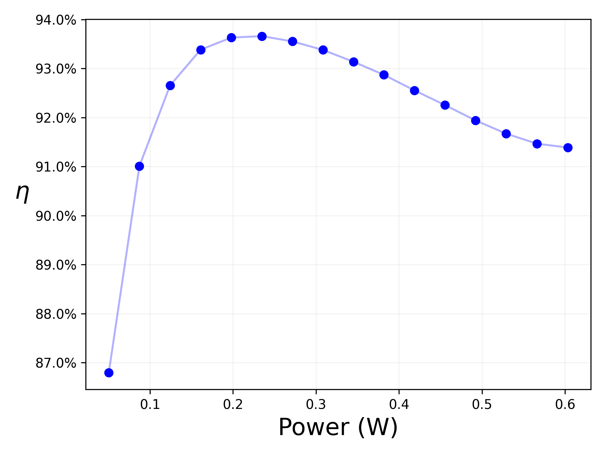

## Validation
The analog blocks all have analog testbenches as xschem files that are located in the design folders.

This folder contains a script that runs the system test bench through different corner cases and measures the efficiency and stability of the converter.
These results are saved in this folder as csv files.

