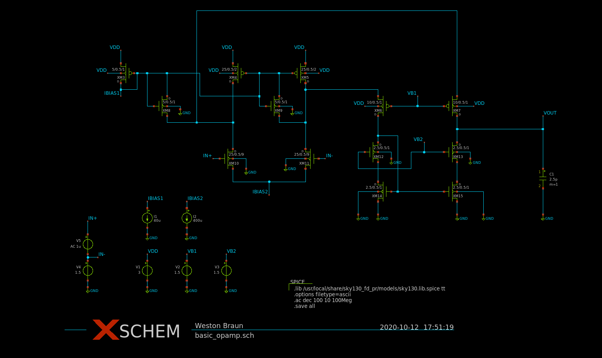
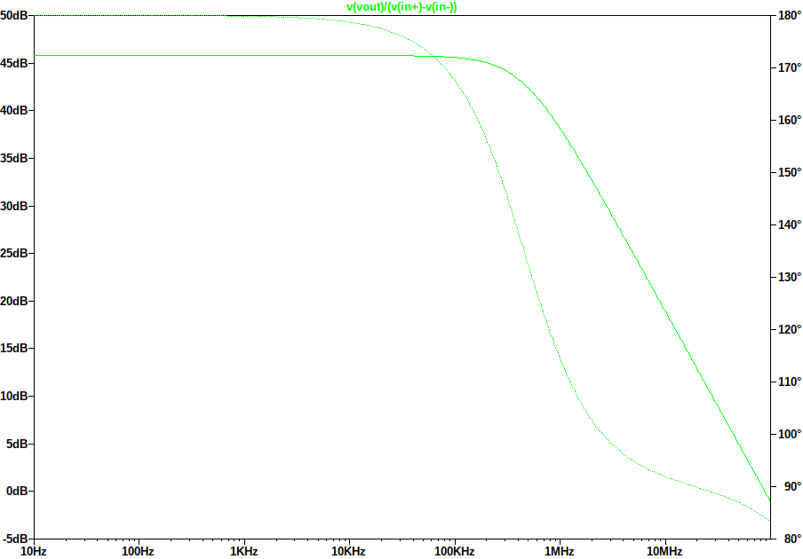

# Design
A basic folded cascode opamp based on the design presented in Fig 6.20 in Analog Integrated Circuit Design 2nd Edition. Transistor sizing is adjusted for the sky130 process. This design needs a bias circuit before it can be layed out.

# Schematic 

# Bode Plot

